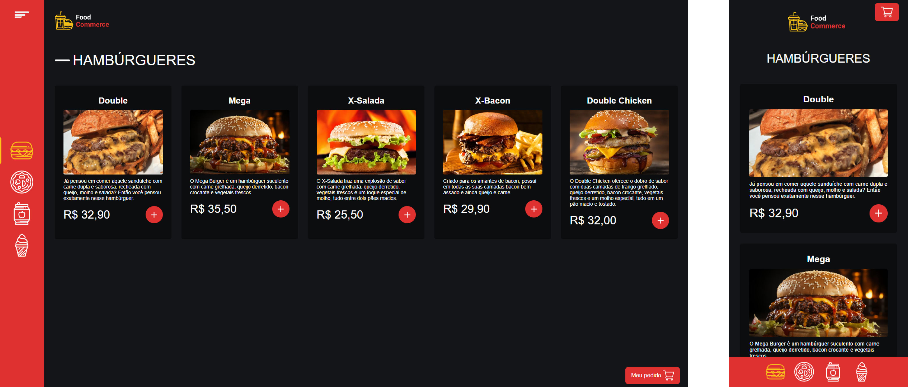

<h1 align="center"> Food Commerce </h1>

<p align="center">
  <a href="#-projeto">Projeto</a>&nbsp;&nbsp;&nbsp;|&nbsp;&nbsp;&nbsp;
  <a href="#-tecnologias">Tecnologias</a>&nbsp;&nbsp;&nbsp;|&nbsp;&nbsp;&nbsp;
  <a href="#-rodando localmente">Rodando Localmente</a>&nbsp;&nbsp;&nbsp;|&nbsp;&nbsp;&nbsp;
  <a href="#-roadmap">Roadmap</a>&nbsp;&nbsp;&nbsp;|&nbsp;&nbsp;&nbsp;
  <a href="#-licença">Licença</a>
</p>

<p align="center">
  
</p>

<br>

## Screenshots



<br>

## 💻 Projeto

Este é um projeto de uma aplicação chamada Food-Commerce. O intuito foi desenvolver um e-commerce de pedidos de lanches online, proporcionando uma navegação agradável e intuitiva para os usuários. A aplicação inclui um cardápio completo dividido por seções em um menu de navegação, uma página de carrinho onde os usuários podem revisar seus pedidos, ajustar quantidades, remover itens e visualizar o total atualizado em tempo real, facilitando o processo de checkout, além de um formulário para pagamentos com cartão de crédito. O design é interativo e responsivo, aumentando o engajamento e garantindo uma ótima experiência em dispositivos móveis e desktops.

<br>

## 🚀 Tecnologias

Esse projeto foi desenvolvido com as seguintes tecnologias:

-  [React](https://reactjs.org/)
-  [Vite](https://vitejs.dev/)
-  [TypeScript](https://www.typescriptlang.org/)
-  [Styled-Components](https://styled-components.com/)
-  [Yup](https://github.com/jquense/yup)

<br>

## 🖥️ Rodando localmente

Clone o projeto

```bash
  git clone https://link-para-o-projeto
```

Entre no diretório do projeto

```bash
  cd my-project
```

Instale as dependências

```bash
  npm install
```

Inicie o json-server

```bash
  npm run json-server
```

Inicie o servidor

```bash
  npm run dev
```

<br>

## 📝 Roadmap

-  Melhorar o formulário de pagamento para uma experiência mais intuitiva e segura.

-  Adicionar suporte para mais opções de pagamentos.

-  Desenvolver o backend da aplicação e integrar a API construída no backend para fornecer funcionalidades completas e seguras.

## 📜 Licença

[MIT](https://choosealicense.com/licenses/mit/)

<br>

---

Made with ♥ by Lucas Mendes :wave:
